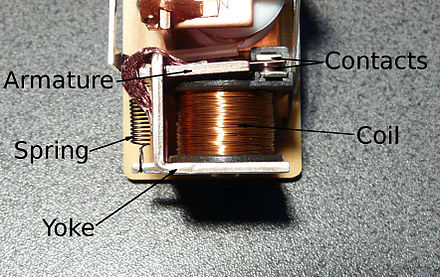
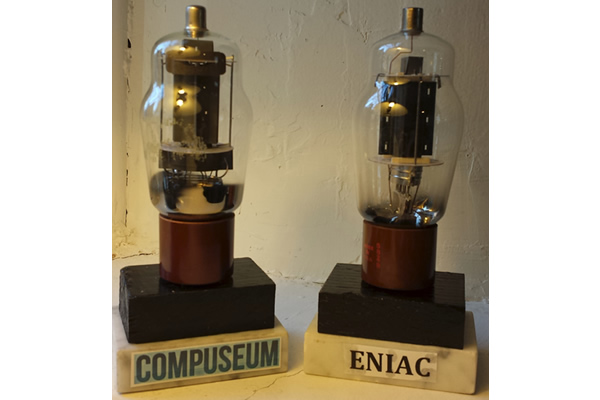
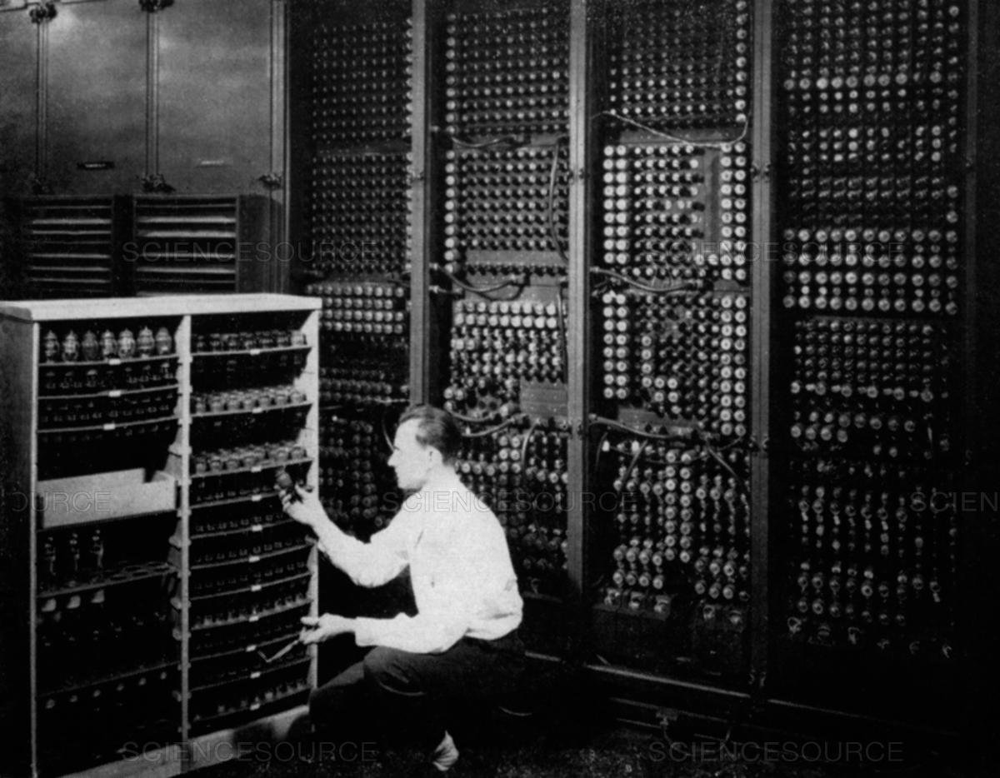
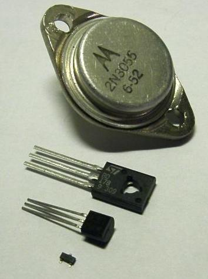
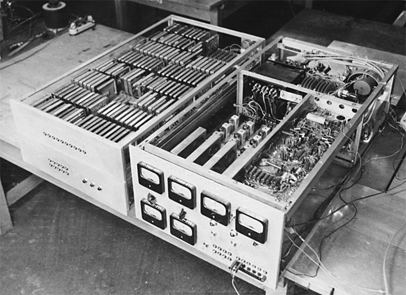
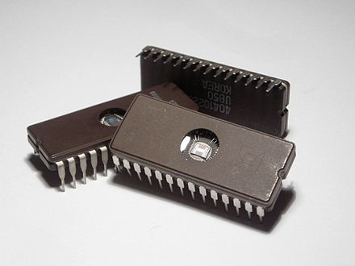
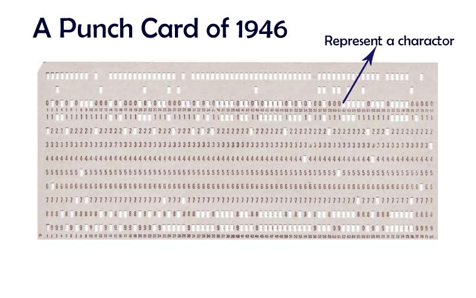

# 정보의 표현

---

## 컴퓨터의 역사

- 전기-기계식 컴퓨터
  - 릴레이
- 전자식 컴퓨터
  - 진공관
  - 트랜지스터
  - 집적 회로

---

## 릴레이, 진공관, 트랜지스터

- 전기를 이용해 **꺼진 상태, 켜진 상태**를 나타낼 수 있음
- [릴레이 작동 영상](https://youtu.be/2QpVafNUfMw?t=3m50s)
- 작동 원리는 다르지만 **진공관, 트랜지스터** 모두 같은 역할을 함

---

## 릴레이

---

## 릴레이를 사용한 컴퓨터

---

## 릴레이를 사용한 덧셈 기계

---

## 진공관

---

## 진공관을 사용한 컴퓨터

---

## 트랜지스터

---

## 트랜지스터를 사용한 컴퓨터

---

## 집적 회로

---

## 집적 회로를 사용한 컴퓨터

<!-- 현재는 5나노미터까지 나왔다 (2017, IBM)
사람의 머리카락의 평균 굵기: 80 µm
트랜지스터 * 16000 = 머리카락 -->

---

## 정보의 표현?

---

## 정보의 표현?

---

## 컴퓨터는 0과 1 밖에 모른다

- 스위치가 꺼진 상태는 0, 켜진 상태는 1로 간주
- 0과 1만을 가지고 어떻게 정보를 표현할 것인가?

---

## 0과 1로 정보 표현하기

- 수
  - 이진법
  - 부동소수점
- 문자
  - 아스키 코드
  - 유니코드
- ...

---

## 십진법 & 이진법 & 16진법

---

## 정보의 크기를 나타내는 단위

- 1 비트(bit) = 0과 1 = 두 가지 경우의 수
- 1 바이트(byte) = 8 비트 = 256 가지 경우의 수
- [바이트 크기 단위](https://ko.wikipedia.org/wiki/%EB%B0%94%EC%9D%B4%ED%8A%B8)
