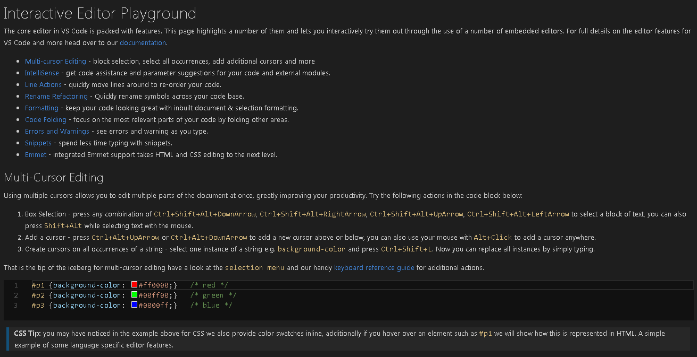

# Visual Studio Code

---

# 소스코드 편집 도구의 분류

- 텍스트 편집기
  - 메모장, nano, ...
- 개발자용 소스코드 편집기
  - vim, Sublime Text, Visual Studio Code, ...
- 통합 개발 환경 (IDE)
  - Visual Studio, Xcode, IntelliJ, WebStorm, ...

---

# 소스코드 편집 도구 선택하기

- 어떤 도구를 선택할 것인지는 **개인 혹은 팀의 선호에 따른 선택 사항**
- 근래의 소스코드 편집기는 **플러그인 설치로 기능을 확장**할 수 있어서, 통합 개발 환경 못지 않게 편한 개발 환경을 구축할 수 있게 됨
- 입문자에게는 기능이 간단한 도구가 권장됨

---
<!-- 직접 보여주기 -->

# Visual Studio Code

- MS에서 2015년에 오픈소스로 내놓은 소스코드 편집기
- Windows, Linux, macOS 모두 지원
- 다양한 프로그래밍 언어 지원
- 다양한 개발 편의 기능을 내장하고 있음
- **2018년 현재 프론트엔드 개발을 위해 가장 널리 사용되는 편집기**

---

# 기본 사용법

- **폴더 열기**
- 사이드바 (`^B` or `⌘B`)
- 터미널 (``^` ``)
- 빠른 열기 (`^P` or `⌘P`)
- 명령 팔레트 (`^⇧P` or `⌘⇧P`)

---

# 편집

- 편집기 분할 (`^\` or `⌘\`)
- 다중 커서 편집 (^D or ⌘D, ^⇧L or ⌘⇧L)
- 전체 검색 / 전체 바꾸기

---

# 터미널에서 실행하기

- 커맨드라인 명령 설치
- 터미널에서 VS Code 실행하기
  - `code .`

---

# 설정하기

- 테마 바꾸기
- 설정 바꾸기
- 확장 설치하기

---

# 과제

Visual Studio Code의 **대화형 실습**

