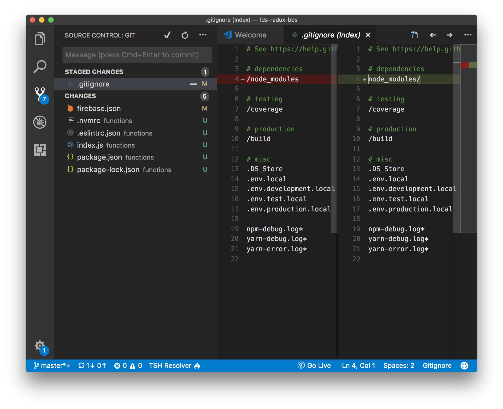

# Git

---

## 프로그래밍은 **변경**의 연속

```
보고서_최종.hwp
보고서_최종_final.hwp
보고서_최종_final_2차.hwp
보고서_최종_final_2차_진짜최종.hwp
보고서_최종_final_2차_진짜최종_끝.hwp
보고서_최종_final_2차_진짜최종_끝_진짜끝.hwp
```

---

## 프로그래밍은 **협업**의 연속


---

## 공유 폴더


- "다 날아갔는데? 한 달 전에 해 둔 백업밖에 없네 ㅠㅠ"
- "누가 이렇게 바꾼거야? 왜 이렇게 고쳤는지 알 수가 있어야지.."

---

## Google 드라이브

- 수정 모드
- 제안 모드
- 버전 기록

---

## 버전 관리 시스템 (VCS)

- 시간에 따른 코드의 변화를 체계적으로 관리하는 소프트웨어
- 아래와 같은 정보를 관리한다.
  - 소스코드가 **언제** 바뀌었는지
  - 소스코드가 **어떻게** 바뀌었는지
  - 소스코드를 **누가** 바꾸었는지
  - 소스코드를 **왜** 바꾸었는지

---

## 버전 관리 시스템을 사용하면

- 시간의 흐름에 따른 **작업 내역**을 확인할 수 있음
- **이전 버전**으로 쉽게 돌아갈 수 있음
- **다른 사람들에게 영향을 미치지 않고** 코드를 변경해볼 수 있음
- 소스코드의 특정 부분을 **누가 언제 변경했는지** 쉽게 확인할 수 있음
- 실수로 파일을 삭제하더라도 **쉽게 복구**할 수 있음

---

## Git

- 사실상 표준으로 사용되는 VCS
- 커맨드라인 명령어를 통해 사용하거나,
- 여러 GUI 프로그램을 통해 사용할 수도 있음.

---

## Git 초기 설정

- `git config --global user.name "<이름>"`
- `git config --global user.email "<이메일 주소>"`

---

## Git 저장소(Repository)

- Git에 의해 관리되는 디렉터리
- `git init` 명령을 통해 특정 디렉터리를 Git 저장소로 만들 수 있음
- 이 때 `.git` 디렉터리가 하위에 생성됨

---

## 저장소의 현재 상태 확인하기

- `git status`

---

## Git에서 관리하는 세 영역


---

## Git에서 관리하는 세 영역

- 작업 디렉토리 (Working directory)
  - 현재 편집 중인 파일이 저장되는 영역
- 스테이징 영역 (Staging area)
  - 저장소에 저장할 변경 사항을 보관하는 임시 저장소
- `.git` 디렉터리 (Repository)
  - 모든 작업 내역이 영구히 저장되는 저장소

---

## 작업 흐름

- 소스코드를 편집한 후...
- `git add <경로>`
  - 작업 디렉터리의 특정 변경 사항을 스테이징 영역에 등록
- `git commit`
  - 스테이징 영역에 올라온 변경 사항을 영구히 보관
- 위 과정을 반복!

---

## 실습

- 디렉터리 및 파일 생성
- `git init`
- `git add .`
- `git commit -m "첫 커밋"`
- `git log`

매 과정마다 `git status` 명령을 실행해서 저장소의 현재 상태를 확인하세요.

---

## Commit?

- Commit이라는 단어는 때에 따라 아래 두 가지 의미를 갖습니다.
  - 스테이징 영역에 올라온 변경 사항을 영구히 보관하는 **행위**
  - 여러 파일에 대한 변경 사항을 하나로 묶어주는 **단위**
- Commit을 통해 실제로 저장되는 정보는 **변경 사항**이지, 파일이 아닙니다.

---

## Github

- 클라우드 형태의 Git 저장소을 제공하는 서비스
- 웹 브라우저를 통해 Git 저장소를 관리할 수 있음
- Git에는 내장되어 있지 않은 다양한 편의기능 제공

---

## Github 초기 설정

- `ssh-keygen` 명령 실행
- `~/.ssh/id_rsa.pub` 내용 복사
- Github 설정에서 SSH key 등록

---

## Git 원격 저장소 (Remote Repo)

- Git 저장소에 다른 Git 저장소의 **주소**를 등록하고 이 저장소와 정보를 주고받을 수 있음
- 파일 업로드/다운로드와 유사하나, Git 저장소끼리 주고받는 정보는 **파일이 아니라 커밋!**

---

## Git Push

- Github 저장소 생성
- `git remote add origin <Github 저장소 주소>`
- `git push -u origin master`

다음 번 부터는 `git push` 명령만 입력해도 잘 푸시됩니다.

---

## Git Pull

- Github에서 파일 편집 (커밋 생성)
- `git pull`

---

## VS Code 에서 Git 기능 사용하기



---

## SourceTree

- 가장 널리 사용되는 GUI 클라이언트


---

## SourceTree 실습

- [설치](https://ko.atlassian.com/software/sourcetree)
- 언어 변경 (영어)
- 편집 - 스테이지 - 커밋

---

## 그 밖의 기능

- Git
  - 브랜치 (`branch`, `checkout`, `merge`, `rebase`)
  - 되돌리기 & 임시 저장 (`reset`, `revert`, `stash`)
- Github
  - Pull Request & Issues & Project

다음 기회에!

---

## 과제

- [생활코딩 Git 강의](https://opentutorials.org/course/1492)