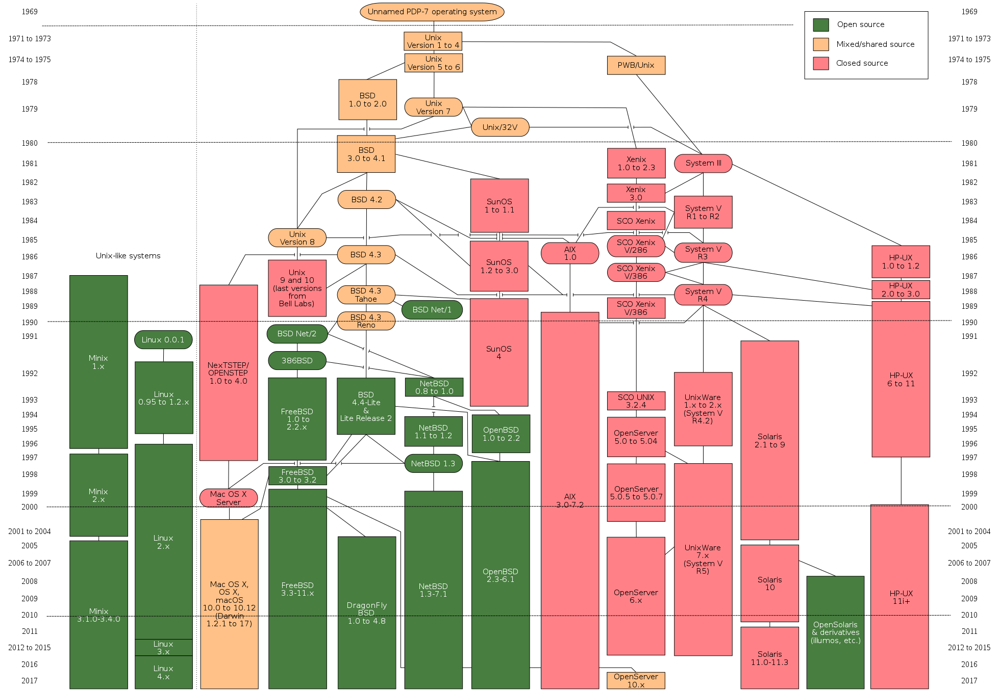
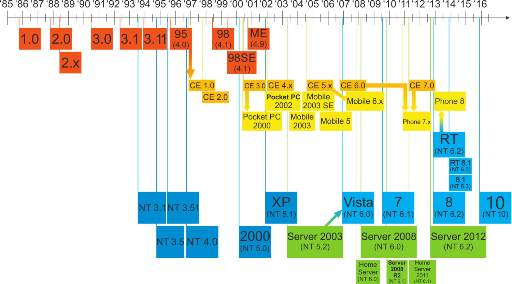
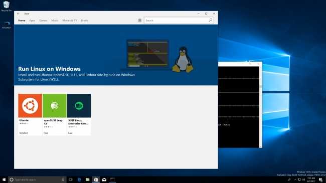

# 운영체제

---

## 운영체제

- 하드웨어를 관리하는 **프로그램**
- **여러 프로그램**이 **한정된 자원**(CPU, 메모리, 입출력 장치)을 공유하는 데 문제가 없도록 중재
- 다른 프로그램이 컴퓨터 자원을 사용할 수 있도록 API를 제공

---

## 윈도우용 프로그램은 왜 맥에서 실행할 수 없는 걸까요?

- 서로 다른 운영체제 API
- 서로 다른 실행파일 형식
  - [PE 포맷](https://ko.wikipedia.org/wiki/PE_%ED%8F%AC%EB%A7%B7)
  - [Mach-O](https://en.wikipedia.org/wiki/Mach-O)
  - [ELF](https://ko.wikipedia.org/wiki/ELF_%ED%8C%8C%EC%9D%BC_%ED%98%95%EC%8B%9D)

---

## Unix 계열 운영체제의 역사

---

## Windows 계열 운영체제의 역사

---

## Windows Subsystem for Linux

- 리눅스 실행 파일을 윈도우에서 실행시킬 수 있도록 만들어주는 호환 계층
- 2017년 10월에 정식 출시되어 확산되고 있는 추세

---

참고 - [C 언어의 아버지, 데니스 리치의 일생](https://joone.net/2017/08/29/10-%EB%8D%B0%EB%8B%88%EC%8A%A4-%EB%A6%AC%EC%B9%98%EC%9D%98-%EC%9D%BC%EC%83%9D/)